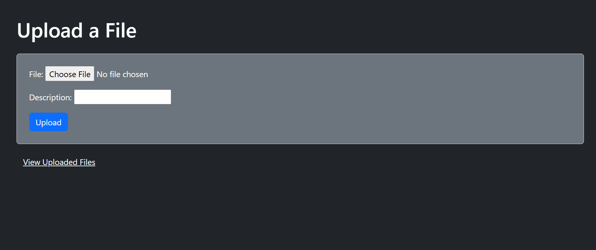
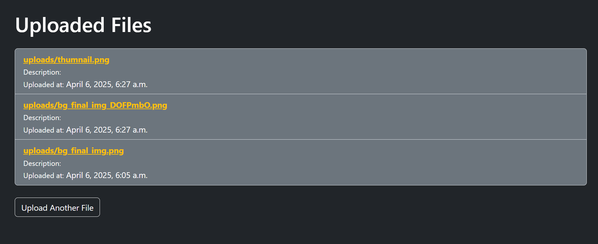

# 🔐 Secure File Upload Portal

This is a lightweight Django web app that shows how to **handle file uploads securely** — with encryption, validation, and a simple UI.

---

## 🧠 What's the idea?

Imagine a file upload feature that:
- Lets users upload documents or images
- Stores a short description along with each file
- Encrypts sensitive data on the backend
- Actually validates the upload

That's what this little project does. It’s meant to demonstrate **good practices**, not just make things work.

---

## 🛠️ What’s under the hood?

- **Python + Django (4.2)** — web framework  
- **django-cryptography** — for encrypting the file descriptions  
- **Bootstrap** — basic dark-themed styling  
- **SQLite** — because it just works for small projects  

---

## 🚀 How to run it

1. Clone the repo:

```bash
git clone https://github.com/your-username/secure-file-upload-portal.git
cd secure-file-upload-portal
```

2. Create a virtual environment:

```bash
python -m venv venv
source venv/Scripts/activate  # On Windows
```

3. Install dependencies:

```bash
pip install -r requirements.txt
```

> Don’t have `requirements.txt` yet? You can generate it with:
```bash
pip freeze > requirements.txt
```

4. Run migrations:

```bash
python manage.py makemigrations
python manage.py migrate
```

5. Start the server:

```bash
python manage.py runserver
```

Visit [http://localhost:8000](http://localhost:8000) in your browser.

---

## 📂 Where do uploads go?

All uploaded files are stored in:

```
media/uploads/
```

Make sure these are set in `settings.py`:

```python
MEDIA_URL = '/media/'
MEDIA_ROOT = os.path.join(BASE_DIR, 'media')
```

---

## 🎯 Why it matters

Handling uploads is a common feature — but it’s also one of the easiest places for bugs, leaks, or even exploits to sneak in. This project shows how to:
- Encrypt data at rest
- Validate file types
- Keep things simple but solid

---

## ✨ What could be next?

- Add file type whitelisting  
- Use cloud storage like GCS or AWS S3  
- Add safe/unsafe upload mode for demo purposes  
- Build out a full login system with user-based access  

---

Made with Django, encryption, and a healthy dose of paranoia 😅

---

## 📸 Screenshots

### 🔼 Upload Page



---

### 📄 File List Page


